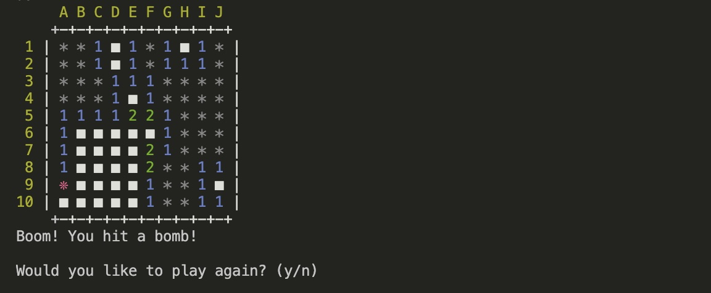

# Minesweeper Terminal Game

## Overview
This project is a take on the classic Minesweeper game, built as a Java terminal program. Players reveal squares trying to avoid any bombs. If a bomb is hit then the gam is over! If a player reveals all non-bomb squares then they win the game.

## Key Features

#### Dynamic grid sizing: 
When starting a game, players can choose the size of the grid, ranging from 2x2 to 15x15. The number of bombs is set to be equal to the number of grid rows chosen.

#### Randomly placed bombd: 
Bombs are randomly placed on the grid when a new game is started, ensuring there's variation in every game.

#### Adjacent bomb count: 
If there are any adjacent bombs to the square that a user reveals, the number of these is reflected accurately to the user.

#### Game Status: 
The game tracks whether the player has won or lost and displays the appropriate messaging.

#### Play Again Option: 
After a game ends, players are able to start a new game without restarting the application through a simple y/n prompt.

#### Improved UI: 
The app uses ANSI colours to differentiate between bombs, numbers, and unrevealed squares for a better user experience.

## Tech Stack
- Java
- ANSI escape codes for terminal styling

## Next Steps
- Include a cascading effect, so that if a user reveals a sqaure that has no adjacent bombs, all adjacent squares with no adjacent bombs will also be revleaed. This would improve the game play experience and be in line with standard minesweeper functionality
- Add the ability to flag suspected bombs so the suer can keep track of their thinking throughout the game
- Clear the terminal each time the grid is re-drawn (whilst maintaining the previous message if it was an error), to provide a more clutter-free experience for users.
- Add unit testing